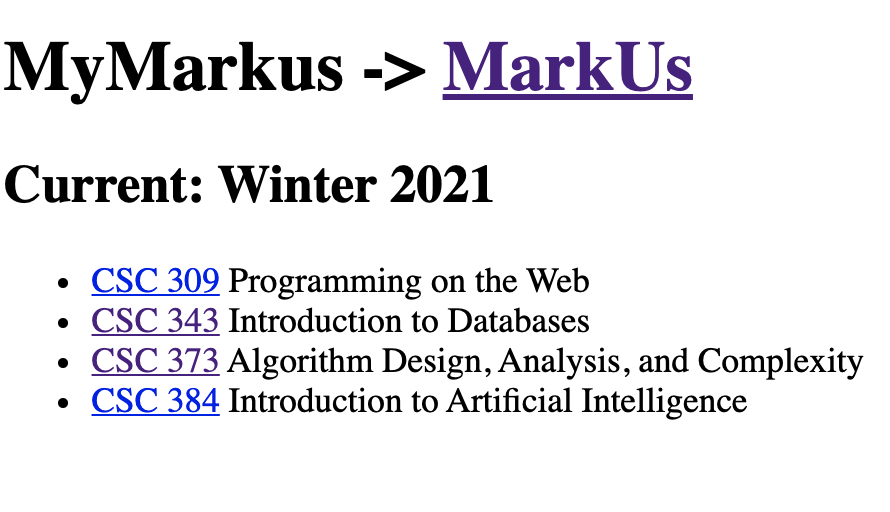

# My
Personalize UofT MarkUs instance

## Purpose
This program helps you to personalize your MarkUs page. So there are only YOUR courses can be displayed here.

## Example


## Build
```bash
gcc -o mm main.c
./mm
```
After generated MyMarkUs.html, open it in your broser and save it for later use. You can add favicon.ico in the generated folder to enable great favicon.

## Upcoming features
- Beautiful UI
- Support Past courses
- ...
